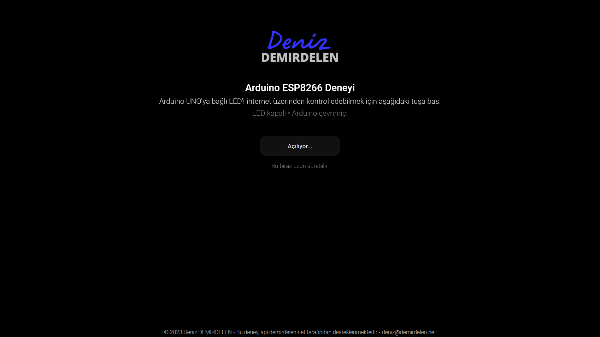

<div align="center">
  <a href="https://deniz.demirdelen.net/">
    
  </a>
  <br>
  <br>
</div>

## Genel Bakış

* Arduino
  - ESP8266 modülünü gerekli ayarlarda başlatma, tanımlanan Wi-Fi ağına bağlama
  - Seri iletişim ile modüle AT komutları gönderme, sonuçlarını doğrulama
  - HTTP istekleri gönderme ve yanıta göre bağlı LED'i yakıp söndürme
  - Kod hatalarına karşı Arduino'yu oto. yeniden başlatma
  - Hata ayıklamayı kolaylaştıran, okunabilir seri çıktısı.
  - [Akıllı İstek Azaltıcı™][1] ile sunucuya gereksiz istekler göndermekten kaçınma
  <br>
  
* Sunucu
  - Node.js ve Express.js kullanılarak yazılmış REST API
  - API anahtarları ile doğrulama
  - API anahtarına göre isteği gönderen cihazı bulma
  - İsteklerin ne zaman gönderildiğini takip ederek Arduino'nun çevrimiçi olup olmadığını kontrol etme.
  - Arduino çevrımdışı ise LED değiştirme isteklerini reddetme
  - Arduino var olan LED değiştirme isteğini okumadığı sürece yeni değiştirme isteklerini reddetme
  - Arduino'nun var olan LED değiştirme isteğinini okuyup okumadığını belirten yanıt değeri
  - Arduino'nun yavaş modda olup olmadığını belirten yanıt değeri
  - Anlık durumu JSON dosyasına kaydetme, bu sırada herhangi bir hata oluşması durumunda yeniden deneme
  - Anlık durumun gelen istekle aynı olması gibi durumlarda herhangi bir işlem yapmamak gibi performans optimizasyonları
  <br>
  
* Web
  - Fetch kullanarak javascript üzerinden HTTP istekleri gönderme
  - Polling ile canlı veri sağlama
  - Anlık durumu kontrol etme (açık, uykuda, çevrimdışı vb.)
  - LED durumunu okuma ve değiştirme
  - Responsive arayüz
  - Aura Parıltısı™ ile LED'in açık olduğunu belirten ışık efekti
<br>

## Ekran Görüntüleri

<div align="center">
  
  
  
  
  
</div>

## API Kullanımı

### Arduino
```
GET https://api.demirdelen.net/esp?slow=0&key=w3hLUCppceviC3UyA4hw0M2qFqQJi1v4
```
&emsp; ```slow=[0-1]``` <br>

&emsp; &emsp; [Akıllı İstek Azaltıcı™][1] modunun çalışma durumunu belirtir. Böylece Arduino çevrımdışı sayılmadan 60 saniye boyunca uykuya girebilir.

#### Yanıt

```
led:0
```

&emsp; ```led:[0-1]``` <br>

&emsp; &emsp; Arduino'nun LED'i yakıp yakmaması gerektiğini belirtir.

#

### Web
```
GET https://api.demirdelen.net/esp?key=2hhpKBRkLrr2olCMM8HTUpllqLZWL2BG
```

#### Yanıt

```
{
    "led": false,
    "ledSending": false,
    "slowMode": false,
    "lastSeen": 1.23,
    "isOnline": true
}
```

&emsp; ```led:``` <br>

&emsp; &emsp; Sunucudaki LED durumunu belirtir. Bu değer LED değiştirme isteğinden sonra hemen değişir ancak Arduino'nun bu değeri okuyup işlemesi birkaç saniye (veya daha fazla) süreceğinden şu anlık LED durumunu değil, olması gereken durumu belirtir.

&emsp; ```ledSending:``` <br>

&emsp; &emsp; Arduino, sunucudaki LED durumunu okuyup işleyene kadar değeri ```true``` olur. İsteğin Arduino'ya ulaşıp ulaşmadığını kontrol etmek için kullanılabilir ancak başarılı olup olmadığını belirtemez.

&emsp; ```slowMode:``` <br>

&emsp; &emsp; Arduino'nun [Akıllı İstek Azaltıcı™][2] modunda olup olmadığını belirtir. LED değiştirme istekleri Arduino'ya 60 saniye gibi bir süre kadar ulaşmayabilir, çünkü Arduino'nun bu modda daha az istek göndermesi beklenir.

&emsp; ```lastSeen:``` <br>

&emsp; &emsp; Arduino'nun gönderdiği son istekten bu yana ne kadar süre (sn) geçtiğini belirtir.

&emsp; ```isOnline:``` <br>

&emsp; &emsp; Arduino'nun çevrimiçi olup olmadığını belirtir. Arduino eğer 30 saniye boyunca herhangi bir istek göndermemişse çevrımdışı sayılır. [Akıllı İstek Azaltıcı™][3] modunda bu 60 saniyeye kadar uzayabilir.

#

```
POST https://api.demirdelen.net/esp?led=0&key=2hhpKBRkLrr2olCMM8HTUpllqLZWL2BG
```

&emsp; ```led=[0-1]``` <br>

&emsp; &emsp; Şu anki LED durumunun ayarlanması gereken değeri belirtir.

#### NOT:

&emsp; Arduino'nun çevrimdışı olması veya zaten bir isteğin gönderilmiş ve işleniyor olması gibi durumlar için olası bir HTTP hata koduna karşı hazırlıklı olunmalıdır. Bu istek her zaman başarılı olmaz.

<br>

#

<br>

<div align="center">
  © 2023 Deniz DEMIRDELEN
  <br>
  Bu deney, api.demirdelen.net tarafından desteklenmektedir.
</div>

[1]: arduino/esp.ino#L45
[2]: api/app.js#L80
[3]: api/app.js#L82
